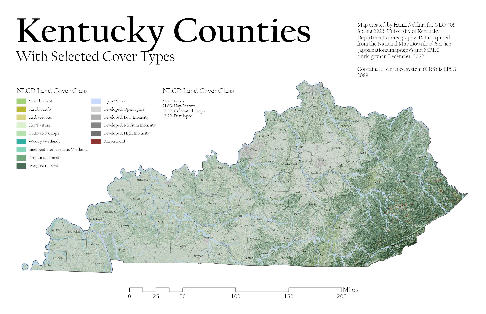
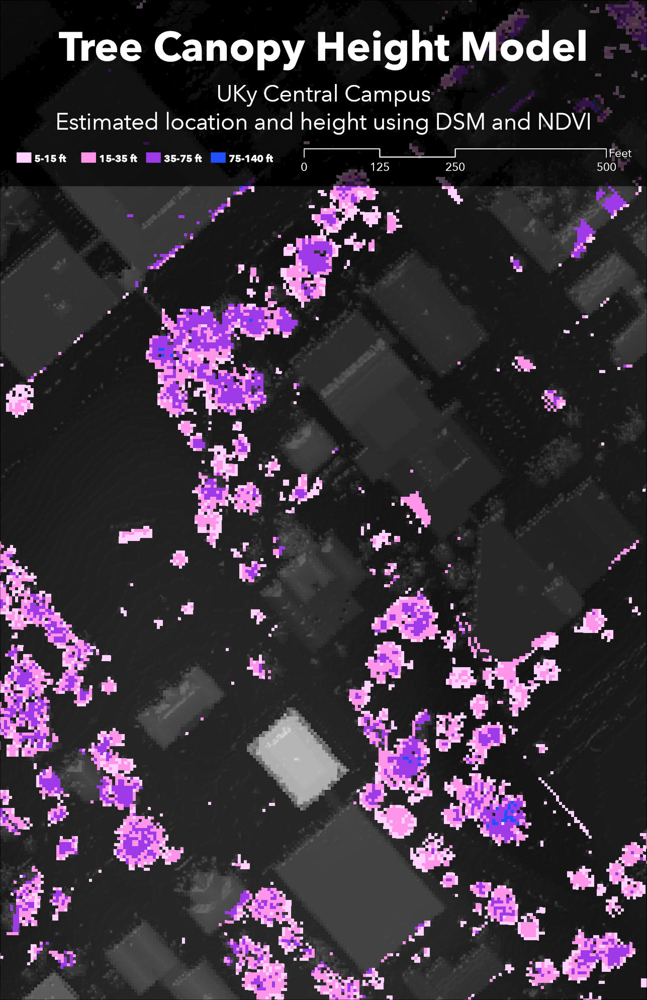

# GEO409 Field Trip Maps
Maps for field trip to measure tree canopy

   
Kentucky counties with selected land cover types – [Download geospatial PDF](Kentucky-Landcover-Layout.pdf)

   
UKy central campus canopy model – [Download geospatial PDF](Campus-Canopy-Layout.pdf)

Maps created by HenriN315 for GEO409, Spring 2023, University of Kentucky Department of Geography
